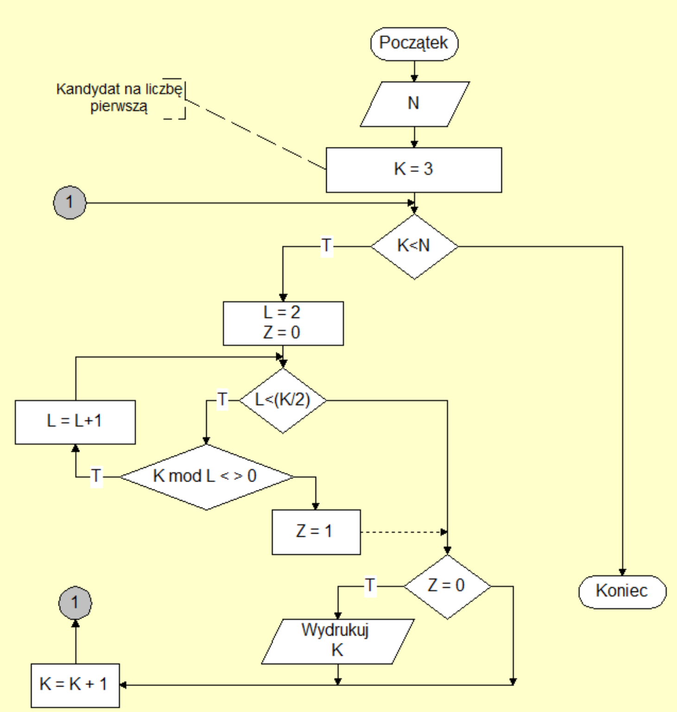
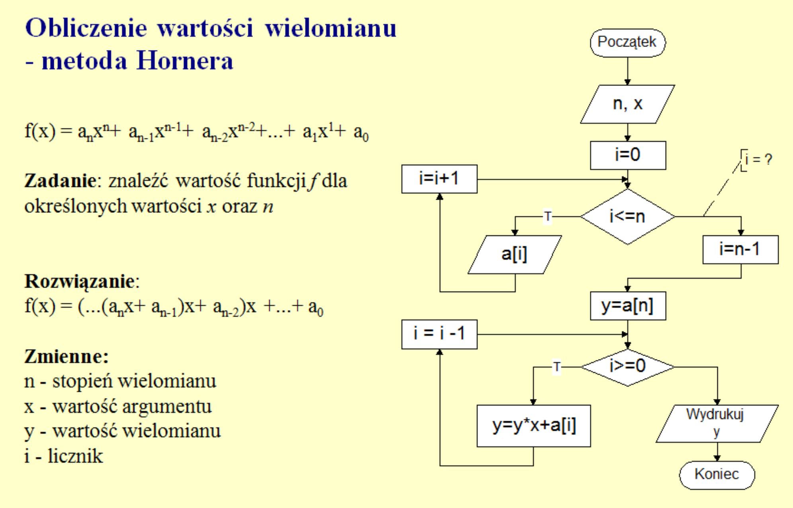
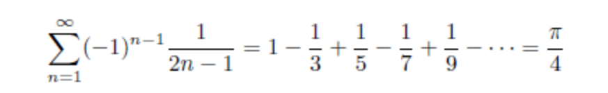
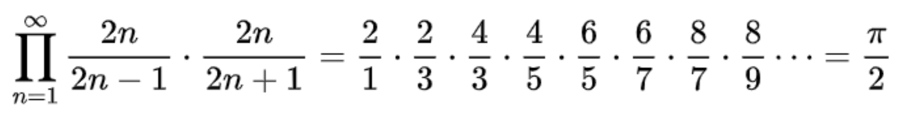

## Zadania laboratoryjne 

### Zadanie nr. 1

Napisz program w dowolnym języku programowania, który realizują poniższy schemat
blokowy:

### Zadanie nr. 2

Napisz program do wyliczenia wartośći wielomianu metodą Hornera:

### Zadanie nr. 3

Obliczyć wartość liczby Pi metodą Leibniz’a

### Zadanie nr. 4

Obliczyć wartość liczby Pi za pomocą wzoru Wallisa:

### Zadanie nr. 5

Znajdź w internecie opis pojęcia liczb bliźniaczych. Napisz program do odnalezienia kilku
takich par w przedziale [1…1000].

### Zadanie nr. 6

Napisz program, który po wprowadzeniu liczby całkowitej wydrukuje jej liczbę lustrzaną.
(np. 1234 -> 4321)

### Zadanie nr. 7

Dano liczbe całkowitą. Napisz program, który wydrukuje jej wartość binarną
(np. 23 = 10111)

### Zadanie nr. 8

Napisz program, który znajdzie liczbę doskonalą w przedziale [1-1000].